<h1 align="center">ModernTechnics</h1>

<p align="center">
  ტექნიკის მაღაზიის მართვის Windows დესკტოპ პროგრამა: თანამშრომლები, ხელფასები, ვაკანსიები, საწყობის მარაგი, გაყიდვები და როლებზე დაფუძნებული წვდომა — ქართულ და ინგლისურ ენებზე.
</p>

<p align="center">
  <a href="https://github.com/MrTabaOfficial/ModernTechnics-Management-System/actions/workflows/ci.yml"></a>
  
  
  
  
  
  
  
</p>

<p align="center"><a href="README.md">English</a> · <b>ქართული</b></p>


## პროექტის შესახებ

ModernTechnics ერთი ტექნიკის მაღაზიის თანამშრომლებისთვის განკუთვნილი დესკტოპ პროგრამაა. მენეჯერი მასში
თანამშრომლების ჩანაწერებს, ხელფასებსა და ვაკანსიებზე შემოსულ განაცხადებს მართავს, საწყობის ოპერატორი მარაგს
იღებს და მაღაზიაში გადააქვს, გამყიდველი კი დახლიდან ყიდის და ძველ შეკვეთებს ათვალიერებს. ყველა საკუთარი
ანგარიშით შედის და მხოლოდ იმ გვერდებს ხედავს, რომლებზეც მის როლს წვდომა აქვს.

თავდაპირველად ეს პროექტი უნივერსიტეტის მესამე კურსის საკურსო ნაშრომად დავწერე .NET Framework 4.7.2-ზე,
SQL Server Express-ითა და კომერციული UI ბიბლიოთეკით. მოგვიანებით ცარიელი solution-იდან თავიდან ავაწყვე, რომ
მევარჯიშა იმაში, რაც პირველ ვერსიას აკლდა: შრეებად დაყოფილი სტრუქტურა (Core, Infrastructure, App, Tests),
EF Core და migration-ები, პაროლების ჰეშირება salt-ით, UI ბიბლიოთეკის ნაცვლად GDI+-ით კოდში დახატული
კონტროლები, ორენოვანი ინტერფეისი და ტესტები, რომლებიც ნამდვილ SQLite ბაზაზე ეშვება. საკურსო ვერსიის კოდი
Git-ის ისტორიაში რჩება.

> **ეს სასწავლო პროექტია სადემონსტრაციო მონაცემებით.** თანამშრომლები, მყიდველები, შეკვეთები და განაცხადები
> გამოგონილია და პირველი გაშვებისას იქმნება, ოთხ სადემონსტრაციო ანგარიშთან ერთად, რომელთა პაროლი საჯაროა.
> Windows-ის თითოეულ მომხმარებელს საკუთარი ლოკალური ბაზის ფაილი აქვს, ანუ სისტემა მრავალმომხმარებლიანი არ
> არის. შეკვეთა ერთი პროდუქტი და რაოდენობაა: კალათა, თანხის დაბრუნება და ქვითარი არ არის.

## სარჩევი

- [შესაძლებლობები](#შესაძლებლობები)
- [ეკრანის ანაბეჭდები](#ეკრანის-ანაბეჭდები)
- [Use case დიაგრამა](#use-case-დიაგრამა)
- [მონაცემთა ბაზა](#მონაცემთა-ბაზა)
- [ტექნოლოგიები](#ტექნოლოგიები)
- [პროექტის სტრუქტურა](#პროექტის-სტრუქტურა)
- [გაშვება](#გაშვება)
- [გვერდები და გაშვების რეჟიმები](#გვერდები-და-გაშვების-რეჟიმები)
- [უსაფრთხოება](#უსაფრთხოება)
- [გამოყენებული რესურსები](#გამოყენებული-რესურსები)
- [ლიცენზია](#ლიცენზია)

## შესაძლებლობები

**ავტორიზაცია და ანგარიშები**

- შესვლა ელ-ფოსტითა და პაროლით; ფანჯარა ბოლოს გამოყენებულ ელ-ფოსტას იმახსოვრებს.
- ენის შეცვლა (ქართული / ინგლისური) ავტორიზაციის ფანჯრიდან; არჩევანი შემდეგ გაშვებაზეც ინახება.
- ოთხი სადემონსტრაციო ანგარიშიდან ნებისმიერის შევსება ერთი დაწკაპუნებით.
- გვერდითა მენიუში მხოლოდ თქვენი როლისთვის ნებადართული მოდულები ჩანს; გამოსვლისას ავტორიზაციის ფანჯარა
  ბრუნდება.
- ადმინისტრატორს შეუძლია ანგარიშის შექმნა, როლის შეცვლა, ახალი პაროლის დაყენება და ანგარიშის წაშლა. ბოლო
  ადმინისტრატორის წაშლა ან როლის დაქვეითება შეუძლებელია, ისევე როგორც იმ ანგარიშის წაშლა, რომლითაც შესული ხართ.

**მთავარი გვერდი**

- თანამშრომლების რაოდენობა, თვიური სახელფასო ფონდი საშუალო ხელფასით, ბოლო 30 დღის შემოსავალი და მარაგში
  არსებული ერთეულები.
- ბოლო 7 დღის შემოსავლის დიაგრამა და გუნდის განაწილება თანამდებობების მიხედვით.
- პროდუქტები, რომელთაგან მაღაზიაში 5 ან ნაკლები ერთეულია დარჩენილი, რჩევით: გადმოიტანეთ საწყობიდან ან
  შეუკვეთეთ.

**თანამშრომლები და ხელფასები**

- თანამშრომლის ჩანაწერის დამატება, შეცვლა, ძებნა და წაშლა (11-ნიშნა პირადი ნომერი, თანამდებობა, საკონტაქტო
  მონაცემები, ოჯახური მდგომარეობა, ხელფასი). თანამშრომელი სულ მცირე 18 წლის უნდა იყოს.
- თითოეული თანამშრომლის თვიური და წლიური ხელფასის ნახვა თვის ჯამთან ერთად და ხელფასის შეცვლა.

**ვაკანსიები**

- განაცხადის აღრიცხვა სასურველი თანამდებობითა და სამოტივაციო წერილით.
- განაცხადის გახსნა წერილის წასაკითხად და სტატუსის შეცვლა: ახალი, გასაუბრება, აყვანილია, უარყოფილია.
  „აყვანილია“ მხოლოდ სტატუსს ცვლის — თანამშრომლის ჩანაწერი ავტომატურად არ იქმნება.

**საწყობი**

- პროდუქტის დამატება, შეცვლა და წაშლა კატალოგში. პროდუქტი, რომელიც ერთხელ მაინც გაიყიდა, ვერ წაიშლება.
- მიღებული პარტიის საწყობში აღრიცხვა და ერთეულების მაღაზიაში გადატანა. თუ გადასატანი რაოდენობა საწყობის
  მარაგს აღემატება, ოპერაცია უარყოფილია.

**მაღაზია, შეკვეთები და მყიდველები**

- დახლზე არსებული პროდუქციის ნახვა წარწერით „მარაგშია“ / „იწურება“ / „ამოიწურა“ და გაყიდვა რეგისტრირებულ
  ან დაურეგისტრირებელ მყიდველზე. შეკვეთაში გაყიდვის მომენტის ფასი ინახება.
- ყველა შეკვეთის დათვალიერება და ძებნა; ქვემოთ ჩანს შეკვეთების რაოდენობა, ერთეულები და ჯამი.
- მყიდველის დამატება, შეცვლა და წაშლა. წაშლილი მყიდველის შეკვეთები რჩება და დაურეგისტრირებელ მყიდველზე
  გაყიდვად ჩანს.

**ყველა სიაში**

- ძებნა აკრეფისთანავე, დახარისხება სვეტის სათაურზე დაწკაპუნებით, არჩეული ჩანაწერის გახსნა ორმაგი დაწკაპუნებით
  ან Enter-ით.
- ვალიდაციის შეცდომები შესაბამისი ველის ქვეშ ჩანს, ინტერფეისის ენაზე.

## ეკრანის ანაბეჭდები

| | |
| --- | --- |
| 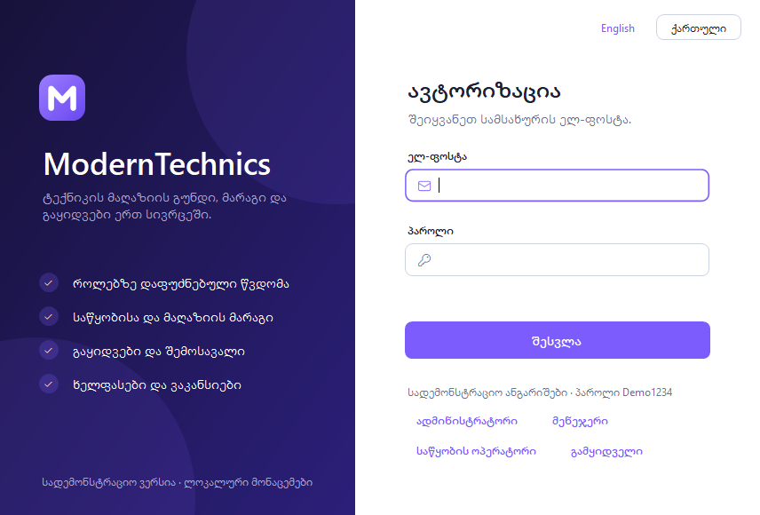<br>ავტორიზაცია: სადემონსტრაციო ანგარიშები და ენის გადამრთველი | <br>მთავარი |
| 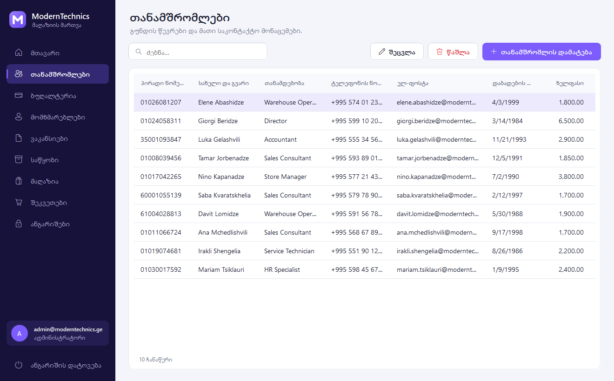<br>თანამშრომლები | 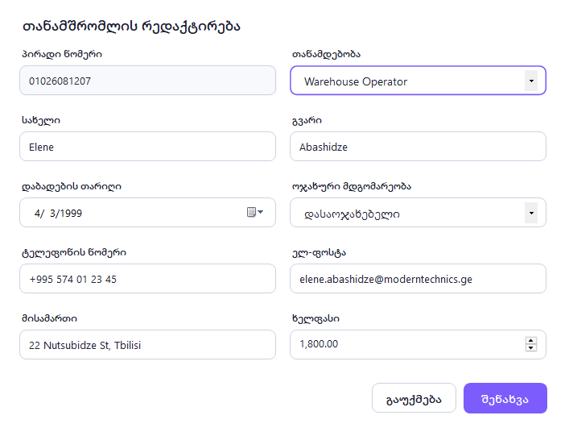<br>თანამშრომლის რედაქტირება |
| 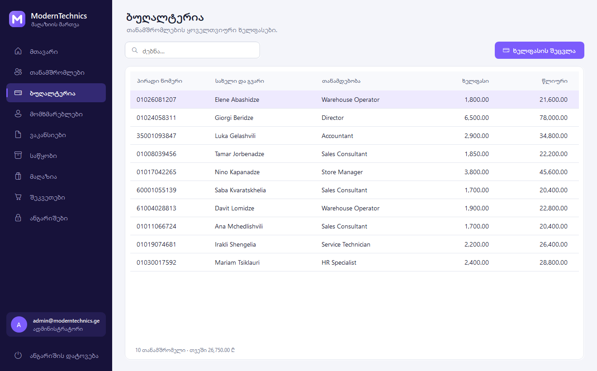<br>ბუღალტერია | 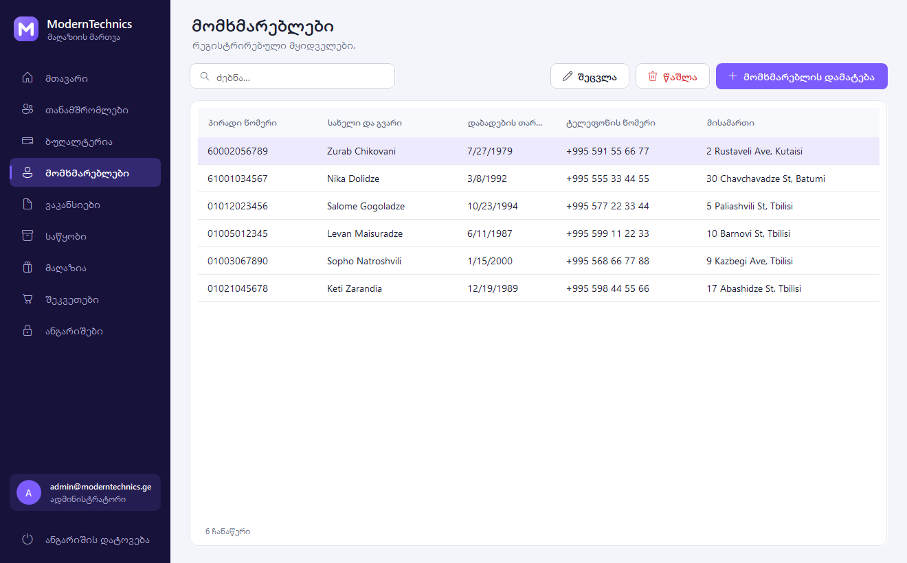<br>მომხმარებლები |
| 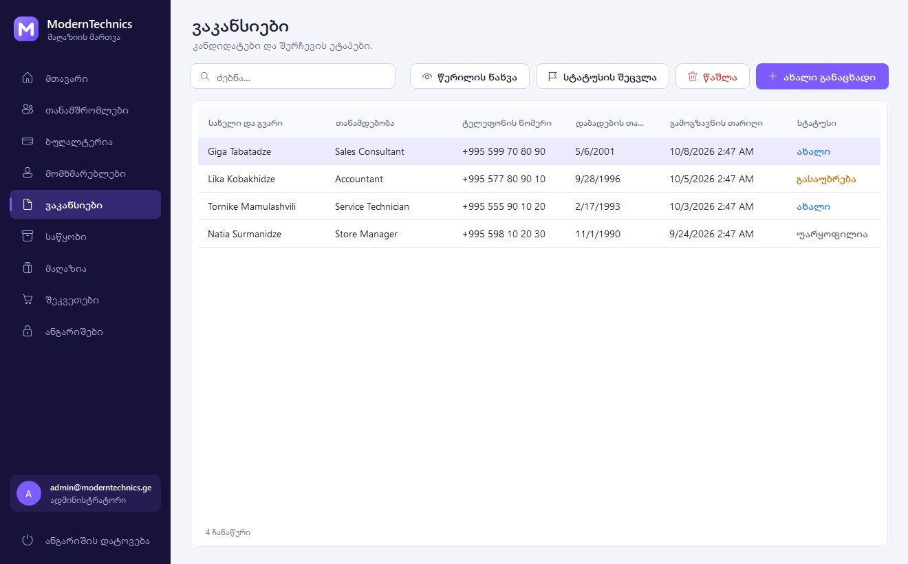<br>ვაკანსიები | 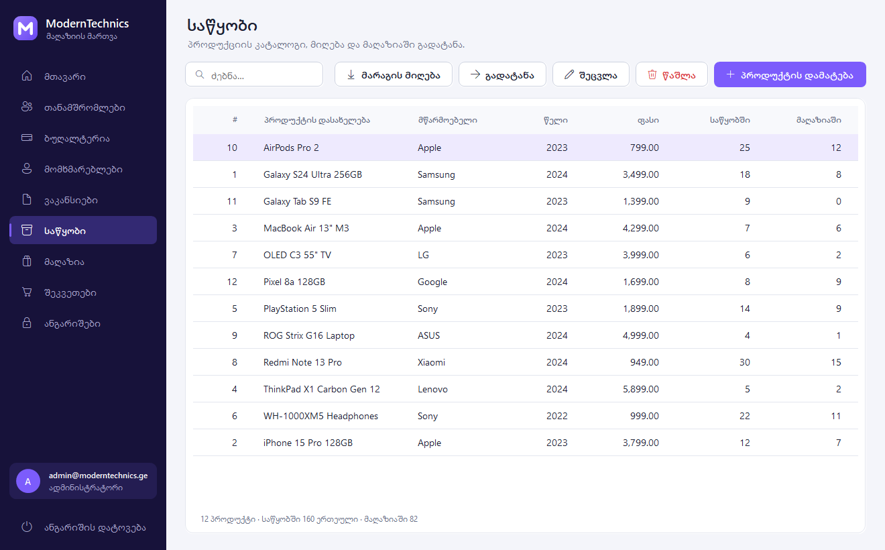<br>საწყობი |
| 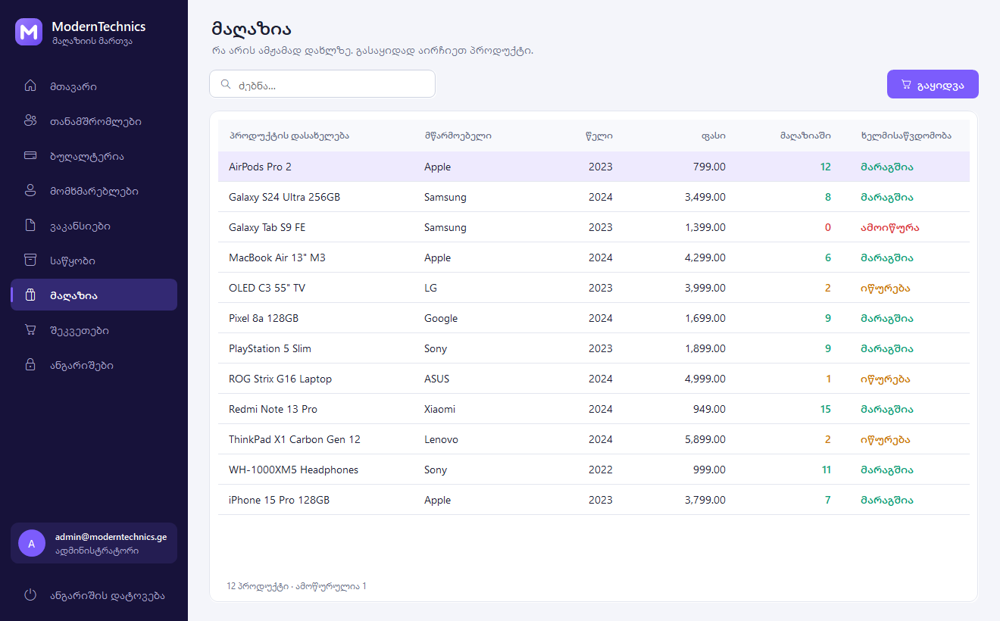<br>მაღაზია | 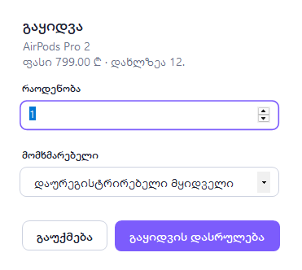<br>გაყიდვის ფანჯარა |
| 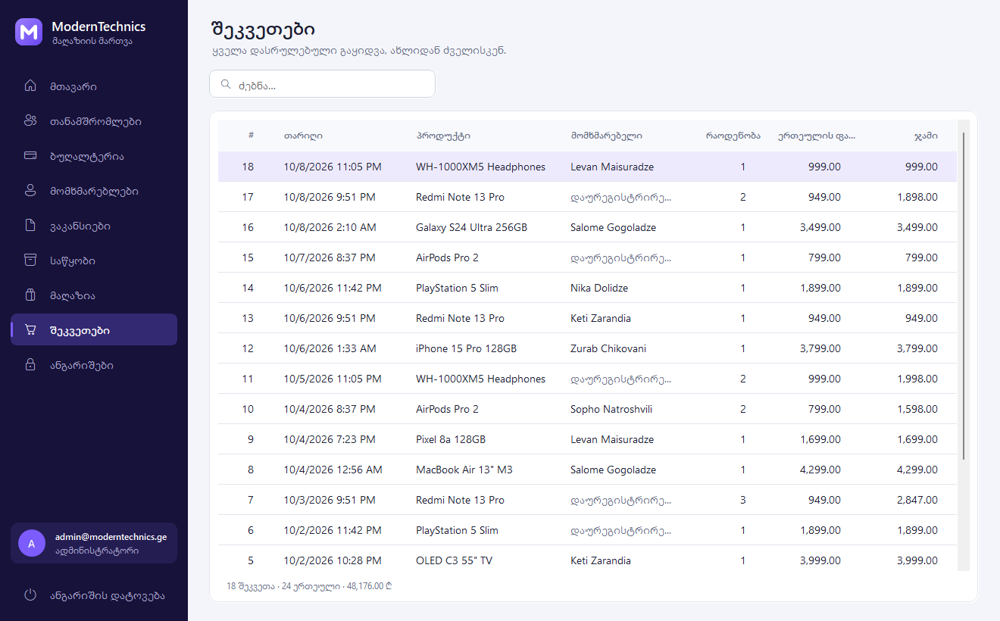<br>შეკვეთები | 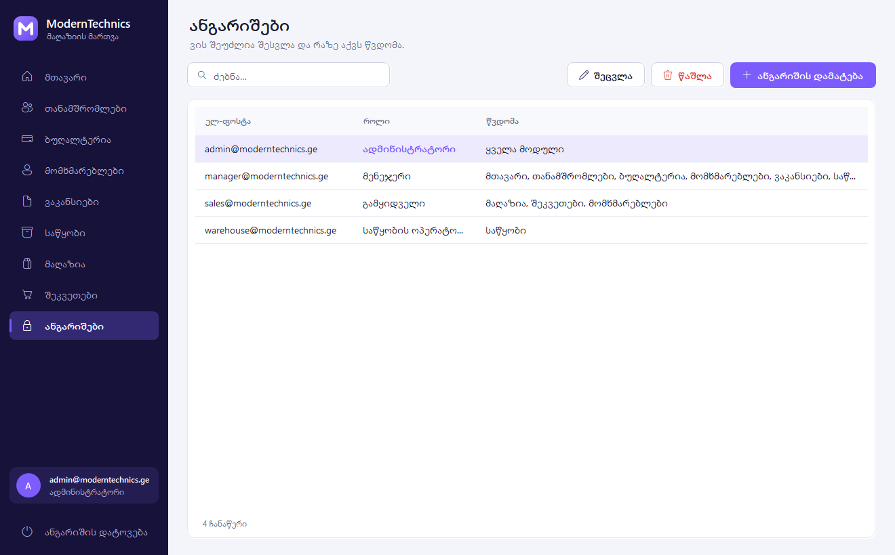<br>ანგარიშები (მხოლოდ ადმინისტრატორისთვის) |
| 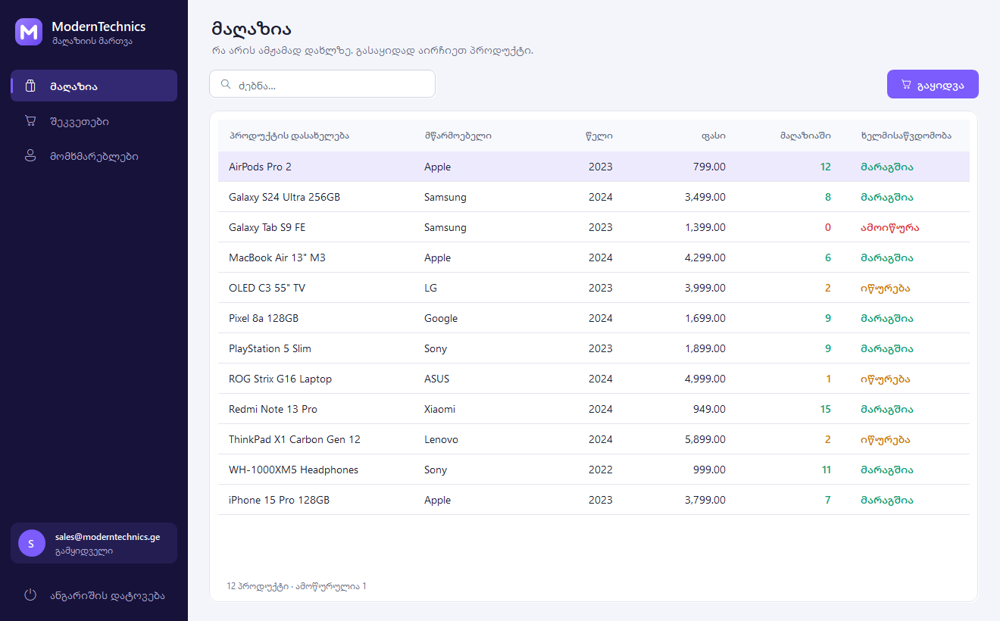<br>იგივე პროგრამა გამყიდველის როლით: სამი მოდული | <br>მთავარი გვერდი ინგლისურად |

ყველა სურათს თავად პროგრამა ქმნის; იხილეთ [გაშვება](#გაშვება). სადემონსტრაციო მონაცემები (სახელები,
თანამდებობები, პროდუქტები) ბაზაში ინგლისურად ინახება, ამიტომ ქართულ ინტერფეისშიც ინგლისურად ჩანს.

## Use case დიაგრამა

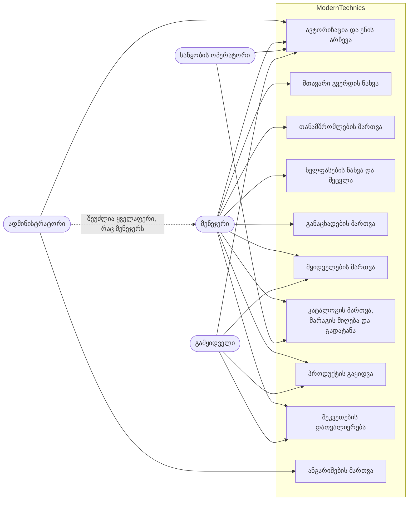

## მონაცემთა ბაზა

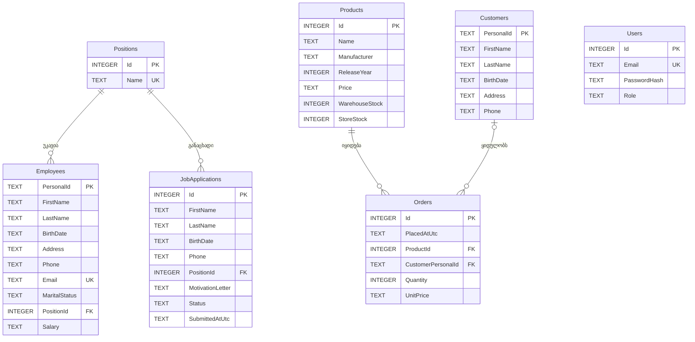

ყველა თანამშრომელი და ყველა განაცხადი ერთ თანამდებობას უკავშირდება, ყველა შეკვეთა — ერთ პროდუქტს და,
სურვილისამებრ, ერთ მყიდველს (მყიდველის წაშლისას ეს კავშირი null ხდება), ხოლო `Users` ცალკე დგას: შესვლის
ანგარიში თანამშრომლის ჩანაწერთან დაკავშირებული არ არის. თანხები და თარიღები `TEXT` ტიპისაა, რადგან EF Core
SQLite-ში `decimal`, `DateOnly` და `DateTime` მნიშვნელობებს ასე ინახავს; `Products` ცხრილს check constraint-ებიც
აქვს, რომლებიც მარაგის ორივე სვეტს ნულზე დაბლა არ უშვებს.

## ტექნოლოგიები

| შრე | ტექნოლოგია |
| --- | --- |
| ენა | C# 14; ჩართულია nullable reference types და warning-ები შეცდომად ითვლება |
| გარემო | .NET 10 (`net10.0`, კლიენტისთვის `net10.0-windows`) |
| ინტერფეისი | Windows Forms, აწყობილი კოდში, designer-ის გარეშე |
| ხატვა | GDI+ (`System.Drawing`): ღილაკები, ბარათები, ველები, დიაგრამები, შეტყობინებები და ლოგო |
| ხატულები | Segoe Fluent Icons, Windows 10-ზე კი Segoe MDL2 Assets |
| მონაცემებთან წვდომა | Entity Framework Core 10.0.12, ერთი migration |
| მონაცემთა ბაზა | SQLite, `Microsoft.EntityFrameworkCore.Sqlite` 10.0.12-ის გავლით |
| კომპოზიცია | `Microsoft.Extensions.DependencyInjection` 10.0.12 |
| პაროლების ჰეშირება | PBKDF2-HMAC-SHA256 (`System.Security.Cryptography`) |
| ლოკალიზაცია | `.resx` ფაილები ქართულისა და ინგლისურისთვის, ორივე მთავარ assembly-ში |
| ტესტები | xUnit v3 3.2.2 და Microsoft.NET.Test.Sdk 18.10.1, in-memory SQLite ბაზაზე |
| CI | GitHub Actions, `windows-latest`: restore, build, test, publish |
| ინსტრუმენტები | Central Package Management, `.editorconfig`, `global.json`-ში დაფიქსირებული SDK |

## პროექტის სტრუქტურა

```text
ModernTechnics-Management-System/
├── .github/workflows/ci.yml             # build, test და publish ყოველ push-სა და pull request-ზე
├── docs/screenshots/                    # README-ს სურათები, რომლებსაც პროგრამა ქმნის
├── src/
│   ├── ModernTechnics.Core/             # დომენი; გარე პაკეტების გარეშე
│   │   ├── Common/
│   │   │   ├── Error.cs                 # შეცდომის ჩანაწერი და შეცდომის კოდები
│   │   │   └── Result.cs                # Result და Result<T>, რომელსაც ყველა სერვისი აბრუნებს
│   │   ├── Domain/                      # Employee, Customer, Product, Order, JobApplication,
│   │   │                                #   Position, UserAccount და enum-ები
│   │   ├── Security/
│   │   │   ├── AccessPolicy.cs          # რომელ როლს რომელი მოდულის გახსნა შეუძლია
│   │   │   └── IPasswordHasher.cs
│   │   ├── Services/
│   │   │   ├── Contracts.cs             # სერვისების ინტერფეისები
│   │   │   └── DashboardSummary.cs      # მთავარ გვერდზე ნაჩვენები მაჩვენებლები
│   │   └── Validation/
│   │       ├── Validator.cs             # ვალიდაციის წესები (ელ-ფოსტა, ტელეფონი, პირადი ნომერი, …)
│   │       └── EntityValidators.cs      # წესები თითოეული entity-სთვის
│   ├── ModernTechnics.Infrastructure/   # მონაცემებთან წვდომა და სერვისების იმპლემენტაცია
│   │   ├── Data/
│   │   │   ├── AppDbContext.cs          # mapping, ინდექსები, შეზღუდვები
│   │   │   ├── DatabaseInitializer.cs   # უშვებს migration-ს და ცარიელ ბაზას ავსებს
│   │   │   ├── DemoData.cs              # სადემონსტრაციო ანგარიშები, თანამშრომლები, პროდუქტები, შეკვეთები
│   │   │   ├── DesignTimeDbContextFactory.cs  # dotnet ef ინსტრუმენტისთვის
│   │   │   └── Migrations/              # EF Core-ის მიერ გენერირებული
│   │   ├── Security/Pbkdf2PasswordHasher.cs
│   │   ├── Services/                    # Auth, User, Employee, Customer, JobApplication,
│   │   │   │                            #   Inventory, Sales და Dashboard სერვისები
│   │   │   └── Search.cs                # საძიებო ტექსტის დამუშავება LIKE-ისთვის
│   │   └── DependencyInjection.cs       # AddModernTechnics() რეგისტრაცია
│   └── ModernTechnics.App/              # Windows Forms კლიენტი
│       ├── Assets/app.ico
│       ├── Controls/                    # AppButton, AppGrid, Card, Charts, FieldHost,
│       │                                #   FormField, NavButton, StatCard, Toast
│       ├── Forms/
│       │   ├── LoginForm.cs             # ავტორიზაცია, ენის გადამრთველი, სადემონსტრაციო ანგარიშები
│       │   ├── MainForm.cs              # გვერდითა მენიუ, სათაური და ნავიგაციის შემოწმება
│       │   └── FormDialog.cs            # დამატების/შეცვლის ზოგადი ფანჯარა ველების შეცდომებით
│       ├── Localization/
│       │   ├── L.cs                     # ტექსტების მოძებნა, თანხისა და თარიღის ფორმატირება
│       │   ├── Strings.resx             # ინგლისური
│       │   └── Strings.ka.resx          # ქართული
│       ├── Pages/
│       │   ├── PageBase.cs              # გვერდი ერთხელ იწყობა, მონაცემები ყოველ გახსნაზე ახლდება
│       │   ├── ListPage.cs              # საძიებო ველი, დახარისხებადი ცხრილი და ღილაკების პანელი
│       │   └── *Page.cs                 # თითო გვერდი თითო მოდულისთვის, სულ ცხრა
│       ├── Ui/                          # Theme (ფერები, შრიფტები, DPI), Draw, Brand, Shell
│       ├── AppSettings.cs               # მონაცემების საქაღალდე და შენახული პარამეტრები
│       ├── Program.cs                   # entry point
│       └── ScreenshotRunner.cs          # --screenshots რეჟიმი
├── tests/
│   └── ModernTechnics.Tests/
│       ├── Localization/ResourceTests.cs    # ორივე ენის ტექსტები ემთხვევა ერთმანეთსა და კოდს
│       ├── Security/                        # პაროლების ჰეშირება, წვდომის წესები
│       ├── Services/                        # ავტორიზაცია და ანგარიშები, პერსონალი, მარაგი და გაყიდვები
│       ├── Support/                         # in-memory SQLite ბაზა, ფიქსირებული საათი
│       └── Validation/ValidatorTests.cs
├── .editorconfig                        # კოდის სტილი
├── Directory.Build.props                # კომპილატორის საერთო პარამეტრები
├── Directory.Packages.props             # NuGet ვერსიები ერთ ადგილას
├── global.json                          # დაფიქსირებული .NET SDK
├── ModernTechnics.slnx                  # solution
├── README.md
├── README.ka.md
└── LICENSE
```

## გაშვება

**რა არის საჭირო**

- Windows 10 ან 11. კლიენტი Windows Forms-ზეა, ამიტომ Linux-სა და macOS-ზე არ ეშვება.
- [.NET 10 SDK](https://dotnet.microsoft.com/download/dotnet/10.0), ვერსია 10.0.100 ან უფრო ახალი 10.0.
- Git.

მონაცემთა ბაზის სერვერის დაყენება, კონფიგურაციის ან environment ფაილის შევსება საჭირო არ არის.

**ნაბიჯები**

1. დააკლონეთ რეპოზიტორია.

   ```powershell
   git clone https://github.com/MrTabaOfficial/ModernTechnics-Management-System.git
   cd ModernTechnics-Management-System
   ```

2. ააწყვეთ solution. ეს ბრძანება NuGet პაკეტებსაც ჩამოტვირთავს.

   ```powershell
   dotnet build
   ```

3. გაუშვით პროგრამა.

   ```powershell
   dotnet run --project src/ModernTechnics.App
   ```

4. მონაცემთა ბაზის ხელით შექმნა საჭირო არ არის. პირველი გაშვებისას პროგრამა ქმნის ფაილს
   `%LOCALAPPDATA%\ModernTechnics\moderntechnics.db`, უშვებს EF Core migration-ს და, რადგან `Users` ცხრილი
   ცარიელია, ბაზას სადემონსტრაციო მონაცემებით ავსებს.

5. შედით ერთ-ერთი სადემონსტრაციო ანგარიშით. ყველას პაროლია `Demo1234`, ხოლო ავტორიზაციის ფანჯრის ქვედა
   ნაწილში არსებული ღილაკები მონაცემებს თქვენ მაგივრად შეავსებს.

   | როლი | ელ-ფოსტა |
   | --- | --- |
   | ადმინისტრატორი | `admin@moderntechnics.ge` |
   | მენეჯერი | `manager@moderntechnics.ge` |
   | საწყობის ოპერატორი | `warehouse@moderntechnics.ge` |
   | გამყიდველი | `sales@moderntechnics.ge` |

6. გაუშვით ტესტები.

   ```powershell
   dotnet test
   ```

   სულ 93 ტესტია. ისინი ნამდვილ სერვისებს in-memory SQLite ბაზაზე უშვებს, ამიტომ მოწმდება EF Core-ის მიერ
   გენერირებული SQL, ბაზის შეზღუდვები და გაყიდვის ტრანზაქცია.

**სადემონსტრაციო მონაცემებზე დაბრუნება**

დახურეთ პროგრამა და წაშალეთ მონაცემების საქაღალდე; შემდეგი გაშვებისას ის თავიდან შეიქმნება.

```powershell
Remove-Item -Recurse "$env:LOCALAPPDATA\ModernTechnics"
```

**ეკრანის ანაბეჭდების განახლება**

პროგრამას შეუძლია ყველა გვერდი დროებით ბაზაზე გახსნას და თითოეულის PNG შეინახოს:

```powershell
dotnet run --project src/ModernTechnics.App -- --screenshots docs/screenshots
dotnet run --project src/ModernTechnics.App -- --screenshots docs/screenshots --lang ka
```

> თუ Windows-ში ჩართულია Smart App Control, მან შეიძლება დაბლოკოს ნებისმიერი ახლად დაკომპილირებული,
> ხელმოუწერელი პროგრამა, მათ შორის ესეც. Windows ამ შემთხვევაში წერს: "An Application Control policy has
> blocked this file".

## გვერდები და გაშვების რეჟიმები

ეს დესკტოპ პროგრამაა, ამიტომ HTTP route-ები არ აქვს. ცხრილში მათ ნაცვლად ჩამოთვლილია, როგორ ეშვება პროგრამა
და რა გვერდები (მოდულები) აქვს. წვდომას განსაზღვრავს
[AccessPolicy.cs](src/ModernTechnics.Core/Security/AccessPolicy.cs).

| გაშვების რეჟიმი / გვერდი | ვის შეუძლია გახსნა | დანიშნულება |
| --- | --- | --- |
| `ModernTechnics.exe` | ყველას, ვისაც პროგრამის გაშვება შეუძლია | ავტორიზაციის ფანჯარა ენის გადამრთველით |
| მთავარი | ადმინისტრატორი, მენეჯერი | ძირითადი მაჩვენებლები, 7 დღის შემოსავლის დიაგრამა, გუნდი თანამდებობების მიხედვით, მცირე მარაგი |
| თანამშრომლები | ადმინისტრატორი, მენეჯერი | ჩანაწერების დამატება, შეცვლა, ძებნა და წაშლა |
| ბუღალტერია | ადმინისტრატორი, მენეჯერი | თვიური და წლიური ხელფასები, ხელფასის შეცვლა |
| მომხმარებლები | ადმინისტრატორი, მენეჯერი, გამყიდველი | მყიდველების რეესტრი |
| ვაკანსიები | ადმინისტრატორი, მენეჯერი | კანდიდატების აღრიცხვა და სტატუსის შეცვლა |
| საწყობი | ადმინისტრატორი, მენეჯერი, საწყობის ოპერატორი | კატალოგი, მარაგის მიღება, მაღაზიაში გადატანა |
| მაღაზია | ადმინისტრატორი, მენეჯერი, გამყიდველი | დახლის მარაგი და გაყიდვა |
| შეკვეთები | ადმინისტრატორი, მენეჯერი, გამყიდველი | დასრულებული გაყიდვების სია, მხოლოდ სანახავად |
| ანგარიშები | ადმინისტრატორი | ანგარიშები, როლები და პაროლები |
| `ModernTechnics.exe --screenshots <dir> [--lang en\|ka]` | დეველოპერი, ბრძანებათა სტრიქონიდან | ინახავს ყველა გვერდის PNG-ს დროებითი ბაზის გამოყენებით |

შესვლის შემდეგ თითოეული როლი თავისი სიის პირველ მოდულზე ხვდება: ადმინისტრატორი და მენეჯერი — მთავარ გვერდზე,
საწყობის ოპერატორი — საწყობზე, გამყიდველი — მაღაზიაზე.

## უსაფრთხოება

რას აკეთებს კოდი ახლა:

- პაროლები ინახება PBKDF2-HMAC-SHA256 ჰეშის სახით, 210 000 იტერაციით და თითო პაროლისთვის შემთხვევითი 16-ბაიტიანი
  salt-ით. იტერაციების რაოდენობა ჰეშთან ერთად ინახება, შედარება კი constant-time ოპერაციით ხდება.
- ავტორიზაცია ერთსა და იმავე შეცდომას აბრუნებს უცნობი ელ-ფოსტისა და არასწორი პაროლის შემთხვევაში.
- ახალი პაროლი სულ მცირე 8 სიმბოლო უნდა იყოს და ასოსაც უნდა შეიცავდეს და ციფრსაც.
- მხოლოდ ერთი კლასი, `AccessPolicy`, წყვეტს, რომელ როლს რომელი მოდულის გახსნა შეუძლია. გვერდითა მენიუ მის
  მიხედვით იწყობა, ხოლო `MainForm.NavigateAsync` გვერდის ჩვენებამდე მას კიდევ ერთხელ ამოწმებს.
- ბოლო ადმინისტრატორის წაშლა ან როლის დაქვეითება შეუძლებელია და ანგარიში საკუთარ თავს ვერ წაშლის.
- ბაზასთან ყველა მიმართვა EF Core-ის პარამეტრიზებული query-ებით ხდება, ხოლო საძიებო ტექსტი `LIKE` შაბლონში
  გამოყენებამდე escape-დება, ამიტომ `%`, `_` და ბრჭყალები ჩვეულებრივ ტექსტად აღიქმება.
- მონაცემები სერვისებში მოწმდება და არა მხოლოდ ფორმებში; სქემაში დამატებით არის უნიკალური ინდექსები
  ელ-ფოსტებზე, foreign key-ები წაშლის შეზღუდვით და check constraint-ები, რომლებიც მარაგს ნულზე დაბლა არ უშვებს.
- გაყიდვა ტრანზაქციაში სრულდება და მარაგს ერთი პირობითი `UPDATE … WHERE StoreStock >= quantity` ბრძანებით
  ამცირებს, ამიტომ შეკვეთა ვერ ჩაიწერება იმ ერთეულებზე, რომლებიც დახლზე არ არის.
- `--screenshots` რეჟიმი დროებით ბაზაზე მუშაობს და მომხმარებლის მონაცემებს არ ეხება.

რას შევცვლიდი, სანამ ნამდვილ მაღაზიაში გამოვიყენებდი:

- მოვაშორებდი სადემონსტრაციო მონაცემების შევსებას, სადემონსტრაციო ღილაკებსა და ავტორიზაციის ფანჯარაზე
  ნაჩვენებ პაროლს; პირველი ადმინისტრატორი ინსტალაციისას უნდა იქმნებოდეს.
- დავამატებდი წარუმატებელი შესვლის მცდელობების ლიმიტს. ახლა ის არ არის; არც უმოქმედობისას ავტომატური გამოსვლაა.
- როლს სერვისებშიც შევამოწმებდი. ახლა შემოწმება კლიენტშია; ერთ კომპიუტერზე გაშვებული ერთი პროცესისთვის ეს
  საკმარისია, მაგრამ არა იმ შემთხვევაში, თუ სერვისები ოდესმე API-ს უკან აღმოჩნდება.
- დავიცავდი მონაცემების ფაილს. SQLite ბაზა დაუშიფრავი ფაილია Windows-ის მომხმარებლის პროფილში, ამიტომ ვისაც ამ
  ფაილის წაკითხვა შეუძლია, პერსონალურ მონაცემებსაც წაიკითხავს და როლებსაც შეცვლის.
- გადავიდოდი საერთო მონაცემთა ბაზის სერვერზე, თუ ერთსა და იმავე მარაგს რამდენიმე კომპიუტერი უნდა ხედავდეს, და
  დავამატებდი ცვლილებების ჟურნალს: ვინ რა შეცვალა.
- build-ს ხელს მოვაწერდი, რომ Windows-მა არ დაბლოკოს და გაფრთხილება არ აჩვენოს.

## გამოყენებული რესურსები

| რა | რისთვის | ლიცენზია |
| --- | --- | --- |
| [Entity Framework Core](https://github.com/dotnet/efcore) და `Microsoft.Data.Sqlite` 10.0.12 | მონაცემებთან წვდომა | MIT |
| [SQLitePCLRaw](https://github.com/ericsink/SQLitePCL.raw) 2.1.12 (EF Core-ს მოჰყვება) | SQLite-ის native ბიბლიოთეკა | Apache-2.0 |
| [SQLite](https://www.sqlite.org/copyright.html) | მონაცემთა ბაზის ძრავა | Public domain |
| [Microsoft.Extensions.DependencyInjection](https://github.com/dotnet/runtime) 10.0.12 | სერვისების კონტეინერი | MIT |
| [xUnit.net v3](https://github.com/xunit/xunit) 3.2.2 და `xunit.runner.visualstudio` 3.1.5 | ტესტები | Apache-2.0 |
| [Microsoft.NET.Test.Sdk](https://github.com/microsoft/vstest) 18.10.1 | ტესტების გამშვები | MIT |
| Segoe UI, Segoe Fluent Icons, Segoe MDL2 Assets | ტექსტი და ხატულები | შრიფტები Windows-ს მოჰყვება; გამოიყენება გაშვებისას და რეპოზიტორიაში არ დევს |

UI შაბლონი, ხატულების ნაკრები ან მზა სურათები გამოყენებული არ არის. კონტროლები, დიაგრამები და ლოგო კოდშია
დახატული. სადემონსტრაციო მონაცემებში ადამიანები გამოგონილია; პროდუქტების სახელები ნამდვილია, მხოლოდ კატალოგის
ნიმუშად გამოიყენება და მათ მწარმოებლებს ეკუთვნის.

## ლიცენზია

[MIT](LICENSE)
