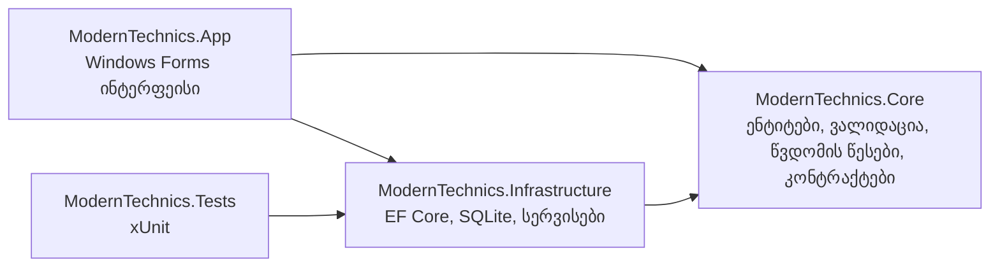

# ModernTechnics

[](https://github.com/MrTabaOfficial/C-Project/actions/workflows/ci.yml)


[English](README.md) · **ქართული**

ტექნიკის მაღაზიის მართვის დესკტოპ პროგრამა: თანამშრომლები, ხელფასები, ვაკანსიები, საწყობის მარაგი, გაყიდვები
და როლებზე დაფუძნებული წვდომა — ქართულ და ინგლისურ ენებზე.

პროგრამა რეპოზიტორიის ჩამოტვირთვისთანავე ეშვება. მონაცემთა ბაზა ლოკალური SQLite ფაილია, რომელიც პირველი
გაშვებისას იქმნება და სადემონსტრაციო მონაცემებით ივსება, ამიტომ არც სერვერის დაყენებაა საჭირო და არც
კონფიგურაცია.


## შესაძლებლობები

| მოდული | რისი გაკეთება შეიძლება | ვინ ხედავს |
| --- | --- | --- |
| მთავარი | თანამშრომლების რაოდენობა, სახელფასო ფონდი, 30 დღის შემოსავალი, 7 დღის შემოსავლის დიაგრამა და პროდუქტები, რომლებიც იწურება | ადმინისტრატორი, მენეჯერი |
| თანამშრომლები | ჩანაწერების დამატება, შეცვლა, ძებნა და წაშლა | ადმინისტრატორი, მენეჯერი |
| ბუღალტერია | თვიური და წლიური ხელფასების ნახვა, ხელფასის შეცვლა | ადმინისტრატორი, მენეჯერი |
| მომხმარებლები | მყიდველების რეესტრი | ადმინისტრატორი, მენეჯერი, გამყიდველი |
| ვაკანსიები | კანდიდატების აღრიცხვა, სამოტივაციო წერილის ნახვა, სტატუსის შეცვლა: ახალი → გასაუბრება → აყვანილია / უარყოფილია | ადმინისტრატორი, მენეჯერი |
| საწყობი | კატალოგის მართვა, მარაგის მიღება, მაღაზიაში გადატანა | ადმინისტრატორი, მენეჯერი, საწყობის ოპერატორი |
| მაღაზია | დახლზე არსებული პროდუქციის ნახვა და გაყიდვა რეგისტრირებულ ან დაურეგისტრირებელ მყიდველზე | ადმინისტრატორი, მენეჯერი, გამყიდველი |
| შეკვეთები | ყველა დასრულებული გაყიდვის ნახვა | ადმინისტრატორი, მენეჯერი, გამყიდველი |
| ანგარიშები | ანგარიშების შექმნა, როლების მინიჭება, პაროლის შეცვლა | ადმინისტრატორი |

გვერდითა მენიუში მხოლოდ ის მოდულები ჩანს, რომლებზეც როლს წვდომა აქვს. მაგალითად, გამყიდველი სამ მოდულს ხედავს:


<details>
<summary>სხვა ეკრანის ანაბეჭდები</summary>

| | |
| --- | --- |
|  |  |
|  |  |
|  |  |
|  |  |

ანაბეჭდების უმეტესობა ინგლისურ ინტერფეისზეა გადაღებული; ქართული ინტერფეისი იმავე ეკრანებს შეიცავს.

</details>

## გაშვება

საჭიროა: Windows 10 ან 11 და [.NET 10 SDK](https://dotnet.microsoft.com/download/dotnet/10.0).

```powershell
git clone https://github.com/MrTabaOfficial/C-Project.git
cd C-Project
dotnet run --project src/ModernTechnics.App
```

ენის შეცვლა ავტორიზაციის ფანჯრის ზედა მარჯვენა კუთხიდან შეიძლება.

შედით ერთ-ერთი სადემონსტრაციო ანგარიშით. ყველას პაროლია `Demo1234`, ხოლო ავტორიზაციის ფანჯარას მათი ავტომატურად
შევსება შეუძლია.

| როლი | ელ-ფოსტა |
| --- | --- |
| ადმინისტრატორი | `admin@moderntechnics.ge` |
| მენეჯერი | `manager@moderntechnics.ge` |
| საწყობის ოპერატორი | `warehouse@moderntechnics.ge` |
| გამყიდველი | `sales@moderntechnics.ge` |

მონაცემები ინახება საქაღალდეში `%LOCALAPPDATA%\ModernTechnics`. სადემონსტრაციო მონაცემებზე დასაბრუნებლად წაშალეთ
ეს საქაღალდე.

> თუ Windows-ში ჩართულია Smart App Control, მან შეიძლება დაბლოკოს ნებისმიერი ახლად დაკომპილირებული, ხელმოუწერელი
> პროგრამა, მათ შორის ესეც. Windows ამ შემთხვევაში წერს: "An Application Control policy has blocked this file".

## ტესტები

```powershell
dotnet test
```

ტესტები რეალურ სერვისებს მეხსიერებაში განთავსებულ SQLite ბაზაზე უშვებს, ამიტომ მოწმდება EF Core-ის მიერ
გენერირებული SQL, შეზღუდვები და ტრანზაქციები და არა მათი იმიტაცია. სხვა საკითხებთან ერთად მოწმდება, რომ:

- ავტორიზაცია ერთსა და იმავე შეცდომას აბრუნებს უცნობი ანგარიშისა და არასწორი პაროლის შემთხვევაში, ხოლო პაროლები
  არასდროს ინახება ღია ტექსტად;
- ბოლო ადმინისტრატორის წაშლა ან როლის დაქვეითება შეუძლებელია და ვერავინ წაშლის საკუთარ ანგარიშს;
- გაყიდვა ამცირებს მაღაზიის მარაგს, ინახავს გაყიდვის მომენტის ფასს და მარაგის უკმარისობისას უარყოფილია ისე,
  რომ არაფერი იცვლება;
- ძებნა სიმბოლოებს `%`, `_` და ბრჭყალებს ჩვეულებრივ ტექსტად აღიქვამს;
- ქართულ და ინგლისურ ტექსტებს ერთნაირი გასაღებები და ჩასანაცვლებელი ველები აქვს და კოდში გამოყენებული ყველა
  გასაღები არსებობს.

## არქიტექტურა



| პროექტი | პასუხისმგებლობა |
| --- | --- |
| `ModernTechnics.Core` | ენტიტები, ვალიდაციის წესები, როლი → მოდული წვდომის წესები, სერვისების კონტრაქტები და `Result` ტიპი. გარე დამოკიდებულებები არ აქვს. |
| `ModernTechnics.Infrastructure` | `AppDbContext`, მიგრაციები, პაროლების ჰეშირება, სერვისების იმპლემენტაცია და სადემონსტრაციო მონაცემები. |
| `ModernTechnics.App` | Windows Forms კლიენტი: კოდით დახატული კონტროლები, გვერდები, დიალოგები და ლოკალიზაცია. |
| `ModernTechnics.Tests` | ზემოთ ჩამოთვლილი სამი პროექტის ტესტები. |

## გამოყენებული ტექნოლოგიები

| სფერო | ტექნოლოგია | დანიშნულება |
| --- | --- | --- |
| ენა | C# 14 | მთელი კოდი; ჩართულია nullable reference types და გაფრთხილებები შეცდომებად ითვლება |
| გარემო | .NET 10 | ოთხივე პროექტის სამიზნე პლატფორმა |
| ინტერფეისი | Windows Forms | ფანჯრები, დიალოგები და ცხრილი |
| ინტერფეისი | GDI+ (`System.Drawing`) | კოდით დახატული ღილაკები, ბარათები, ველები, დიაგრამები და ლოგო |
| ინტერფეისი | Segoe Fluent Icons / Segoe MDL2 Assets | ხატულები — შრიფტი, რომელიც Windows-ს მოყვება |
| მონაცემები | Entity Framework Core 10 | ასახვა, მოთხოვნები და მიგრაციები |
| მონაცემები | SQLite (`Microsoft.Data.Sqlite`) | ლოკალური მონაცემთა ბაზის ფაილი |
| კომპოზიცია | Microsoft.Extensions.DependencyInjection | სერვისების მიწოდება გვერდებისთვის |
| უსაფრთხოება | PBKDF2-HMAC-SHA256 (`System.Security.Cryptography`) | პაროლების ჰეშირება |
| ლოკალიზაცია | `.resx` რესურსები | ქართული და ინგლისური ტექსტები |
| ტესტირება | xUnit v3, Microsoft.NET.Test.Sdk | იუნიტ და ინტეგრაციული ტესტები |
| ინსტრუმენტები | GitHub Actions | აწყობა, ტესტირება და გამოქვეყნება ყოველ push-ზე |
| ინსტრუმენტები | Central Package Management, `.editorconfig`, `global.json` | ვერსიების, სტილისა და SDK-ის ერთიანი მართვა |

## პროექტის ხე (Tech tree)

```text
C-Project/
├── .github/workflows/ci.yml            # აწყობა, ტესტირება და გამოქვეყნება ყოველ push-ზე
├── docs/screenshots/                   # პროგრამის მიერ შექმნილი სურათები
├── src/
│   ├── ModernTechnics.Core/            # დომენი, გარე დამოკიდებულებების გარეშე
│   │   ├── Common/                     # Result, Error და შეცდომის კოდები
│   │   ├── Domain/                     # Employee, Customer, Product, Order, …
│   │   ├── Security/                   # AccessPolicy, IPasswordHasher
│   │   ├── Services/                   # სერვისების კონტრაქტები, DashboardSummary
│   │   └── Validation/                 # Validator, EntityValidators
│   ├── ModernTechnics.Infrastructure/  # მონაცემებთან წვდომა და სერვისები
│   │   ├── Data/                       # AppDbContext, DemoData, DatabaseInitializer
│   │   │   └── Migrations/             # EF Core სქემის მიგრაციები
│   │   ├── Security/                   # Pbkdf2PasswordHasher
│   │   ├── Services/                   # Auth, User, Employee, Customer, Inventory, Sales, …
│   │   └── DependencyInjection.cs      # AddModernTechnics() რეგისტრაცია
│   └── ModernTechnics.App/             # Windows Forms კლიენტი
│       ├── Assets/                     # app.ico
│       ├── Controls/                   # AppButton, AppGrid, Card, Charts, FieldHost, Toast, …
│       ├── Forms/                      # LoginForm, MainForm, FormDialog
│       ├── Localization/               # L.cs, Strings.resx, Strings.ka.resx
│       ├── Pages/                      # ListPage<T> და თითო გვერდი თითო მოდულისთვის
│       ├── Ui/                         # Theme, Draw, Brand, Shell
│       ├── AppSettings.cs              # მონაცემების საქაღალდე და შენახული პარამეტრები
│       ├── Program.cs                  # საწყისი წერტილი
│       └── ScreenshotRunner.cs         # --screenshots რეჟიმი
├── tests/
│   └── ModernTechnics.Tests/
│       ├── Localization/               # ტექსტების ცხრილების შემოწმება
│       ├── Security/                   # პაროლების ჰეშირება, წვდომის წესები
│       ├── Services/                   # ავტორიზაცია, პერსონალი, მარაგი და გაყიდვები
│       ├── Support/                    # სატესტო SQLite ბაზა მეხსიერებაში
│       └── Validation/                 # ვალიდაციის წესები
├── .editorconfig                       # კოდის სტილი
├── Directory.Build.props               # კომპილატორის საერთო პარამეტრები
├── Directory.Packages.props            # NuGet ვერსიები ერთ ადგილას
├── global.json                         # დაფიქსირებული .NET SDK
├── ModernTechnics.slnx                 # სოლუშენი
├── README.md
├── README.ka.md
└── LICENSE
```

## მნიშვნელოვანი გადაწყვეტილებები

- **შეცდომა მნიშვნელობაა და არა გამონაკლისი.** სერვისები აბრუნებს `Result`-ს შეცდომის კოდებით, მაგალითად
  დუბლირებული ელ-ფოსტის შემთხვევაში. კლიენტი თითოეულ კოდს აქტიურ ენაზე თარგმნის და შესაბამისი ველის ქვეშ აჩვენებს.
- **მარაგი უარყოფითი ვერ გახდება.** გაყიდვა და გადატანა ერთი პირობითი `UPDATE … WHERE stock >= quantity`
  ბრძანებით სრულდება, ამიტომ ორი სალარო ვერ გაყიდის ერთსა და იმავე ბოლო ერთეულს. ამას ბაზის სქემაში არსებული
  შეზღუდვებიც ამაგრებს.
- **პაროლები ჰეშირებულია** PBKDF2-HMAC-SHA256 ალგორითმით, 210 000 იტერაციით და თითო პაროლისთვის შემთხვევითი
  „მარილით“. იტერაციების რაოდენობა ჰეშთან ერთად ინახება, რათა მომავალში მისი გაზრდა შეიძლებოდეს.
- **მოთხოვნები პარამეტრიზებულია.** ყველაფერი EF Core-ის გავლით სრულდება, ხოლო საძიებო ტექსტი `LIKE` შაბლონში
  გამოყენებამდე მუშავდება.
- **წვდომის ერთი წყარო.** მხოლოდ `AccessPolicy` განსაზღვრავს, რომელ როლს რომელი მოდულის გახსნა შეუძლია.
  გვერდითა მენიუც და ნავიგაციის შემოწმებაც მას ეყრდნობა.
- **ინტერფეისის გარე ბიბლიოთეკის გარეშე.** ღილაკები, ველები, ბარათები, დიაგრამები და შეტყობინებები კოდითაა
  დახატული, ამიტომ პროექტი კომერციული ლიცენზიის გარეშე იწყობა და ვიზუალი ერთგვაროვანია.
- **ერთი სია — ბევრი გვერდი.** `ListPage<T>` უზრუნველყოფს ძებნას, დახარისხებად ცხრილსა და ღილაკების პანელს.
  ისეთი გვერდი, როგორიცაა „მომხმარებლები“, მხოლოდ სვეტებს, მოქმედებებსა და მონაცემთა წყაროს აღწერს.
- **ორივე ენა მთავარ ასემბლიშია**, ამიტომ დამატებითი რესურსების DLL ფაილების გავრცელება საჭირო არ არის.

## პროექტის ისტორია

პროექტი უნივერსიტეტის მესამე კურსის საკურსო ნაშრომად დაიწყო და მოგვიანებით თავიდან აეწყო.

| | საკურსო ვერსია | ამჟამინდელი ვერსია |
| --- | --- | --- |
| გარემო | .NET Framework 4.7.2 | .NET 10 |
| მონაცემთა ბაზა | SQL Server Express, ერთ კომპიუტერზე მიბმული კავშირის სტრიქონი | SQLite ფაილი, რომელიც პირველ გაშვებაზე იქმნება; EF Core მიგრაციები |
| მონაცემებთან წვდომა | ღილაკების დამმუშავებლებში სტრიქონების შეერთებით აწყობილი SQL | სერვისები პარამეტრიზებული მოთხოვნებით |
| პაროლები | ინახებოდა და მოწმდებოდა ღია ტექსტად | „მარილიანი“ PBKDF2 ჰეშები |
| ინტერფეისი | Bunifu კონტროლები, რომელთა აწყობას კომერციული ლიცენზია სჭირდება | კოდით დახატული კონტროლები, გარე UI ბიბლიოთეკის გარეშე |
| სტრუქტურა | ერთი პროექტი, ლოგიკა `bunifuButton21_Click` ტიპის დამმუშავებლებში | Core, Infrastructure, App და Tests პროექტები |
| ენა | მხოლოდ ქართული ინტერფეისი, ლათინურით ჩაწერილი ქართული იდენტიფიკატორები | ქართული და ინგლისური ინტერფეისი, ინგლისური კოდი |
| ტესტები და CI | არ იყო | xUnit ტესტები, GitHub Actions ყოველ push-ზე |
| რეპოზიტორია | 1 872 ფაილი, მათ შორის `bin`, `obj` და `packages` | მხოლოდ საწყისი კოდი |

საწყისი კოდი Git-ის ისტორიაში რჩება, კომიტამდე "Deleted: Tracked build output and vendored NuGet packages".

## ეკრანის ანაბეჭდების განახლება

`docs/screenshots` საქაღალდის სურათებს თავად პროგრამა ქმნის დროებით მონაცემთა ბაზაზე:

```powershell
dotnet run --project src/ModernTechnics.App -- --screenshots docs/screenshots
dotnet run --project src/ModernTechnics.App -- --screenshots docs/screenshots --lang ka
```

## შემდეგი ნაბიჯები

- ქვითრები და შეკვეთის დასაბეჭდი ფორმა
- რამდენიმე პროდუქტიანი შეკვეთა კალათით
- ხელფასებისა და შეკვეთების CSV ექსპორტი
- ცვლილებების ჟურნალი: ვინ რა შეცვალა
- ხელმოწერილი საინსტალაციო პაკეტი

## ლიცენზია

[MIT](LICENSE)
