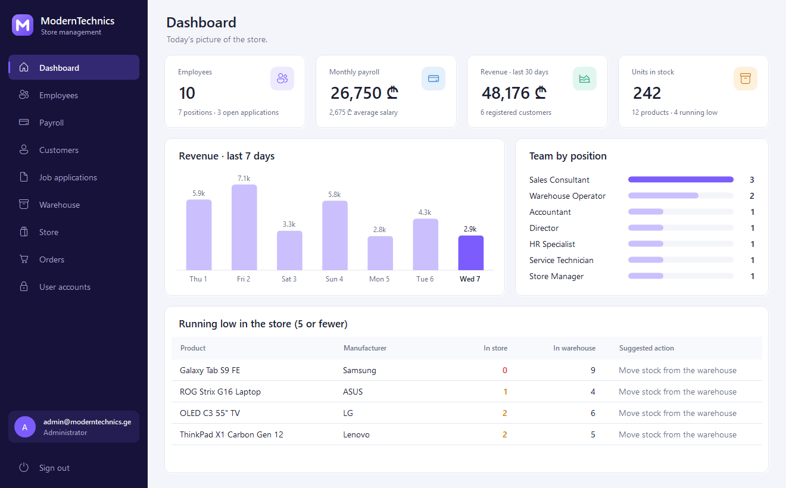
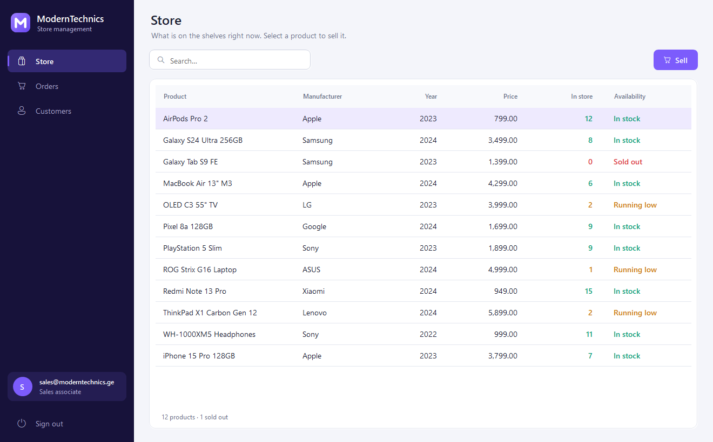
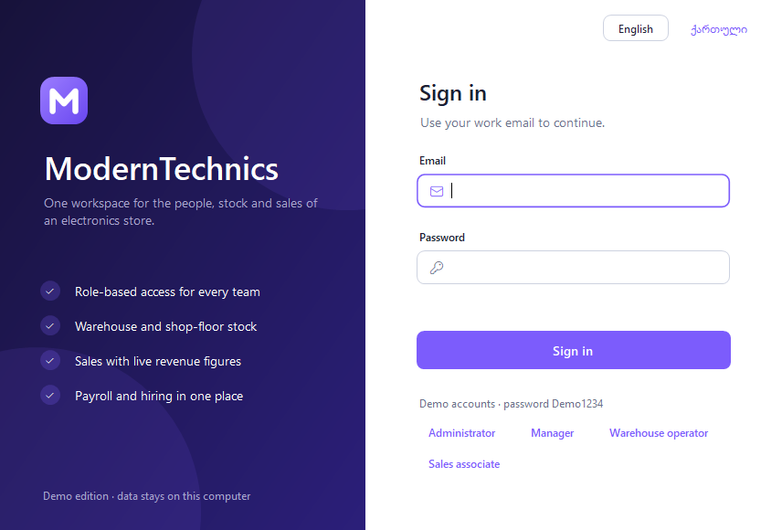
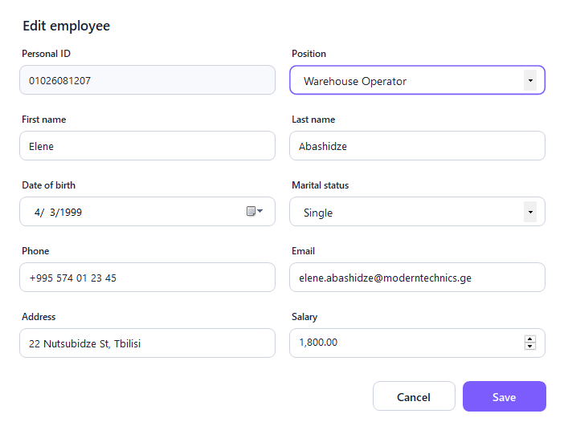
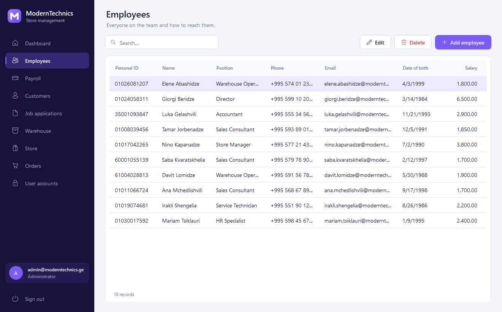
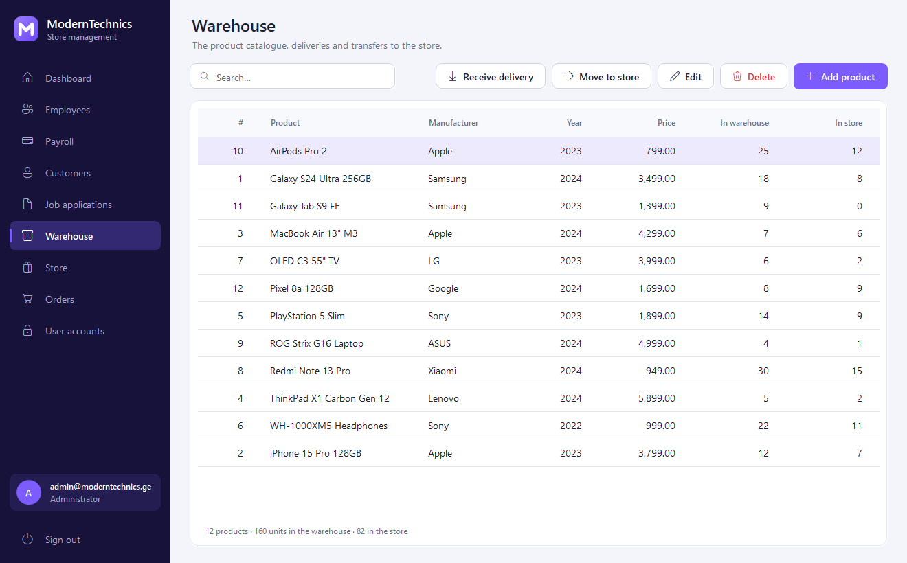
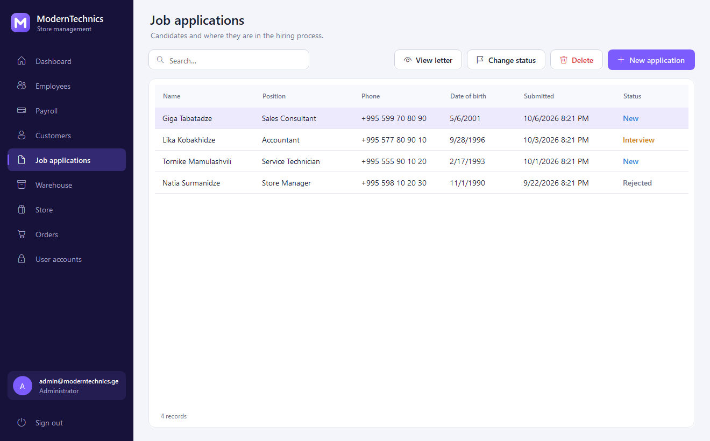
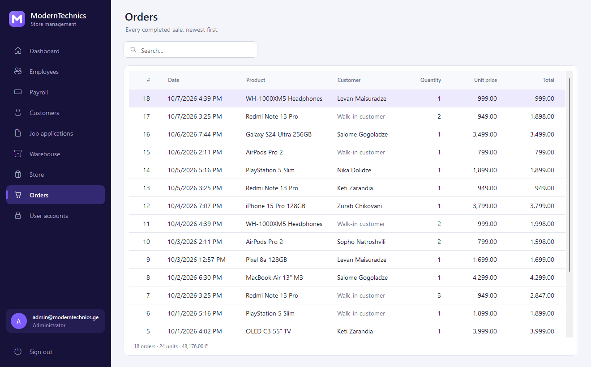
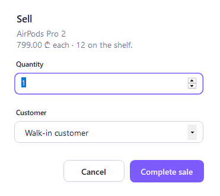
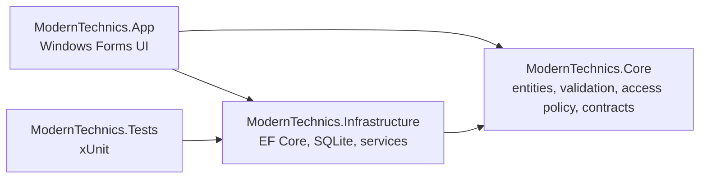

# ModernTechnics

[](https://github.com/MrTabaOfficial/C-Project/actions/workflows/ci.yml)


A desktop back-office for an electronics store: staff, payroll, hiring, warehouse stock, shop-floor sales and
role-based access, in English and Georgian.

It runs straight after cloning. The database is a local SQLite file that is created and filled with demo data on
first launch, so there is no server to install and nothing to configure.



## What it does

| Module | What you can do | Who sees it |
| --- | --- | --- |
| Dashboard | Headcount, payroll, 30-day revenue, a 7-day revenue chart and products running low | Administrator, Manager |
| Employees | Add, edit, search and remove staff records | Administrator, Manager |
| Payroll | Review monthly and annual salaries, change a salary | Administrator, Manager |
| Customers | Keep a register of buyers | Administrator, Manager, Sales associate |
| Job applications | Record candidates, read their letter, move them through New → Interview → Hired / Rejected | Administrator, Manager |
| Warehouse | Maintain the catalogue, book deliveries, move stock to the store | Administrator, Manager, Warehouse operator |
| Store | See what is on the shelf and sell it, to a registered or walk-in customer | Administrator, Manager, Sales associate |
| Orders | Browse every completed sale | Administrator, Manager, Sales associate |
| User accounts | Create accounts, assign roles, reset passwords | Administrator |

The sidebar only lists the modules a role is allowed to open. A sales associate, for example, gets three:



<details>
<summary>More screenshots</summary>

| | |
| --- | --- |
|  |  |
|  |  |
|  |  |
|  |  |

</details>

## Run it

Requirements: Windows 10 or 11 and the [.NET 10 SDK](https://dotnet.microsoft.com/download/dotnet/10.0).

```powershell
git clone https://github.com/MrTabaOfficial/C-Project.git
cd C-Project
dotnet run --project src/ModernTechnics.App
```

Sign in with one of the demo accounts. They all share the password `Demo1234`, and the sign-in window can fill
them in for you.

| Role | Email |
| --- | --- |
| Administrator | `admin@moderntechnics.ge` |
| Manager | `manager@moderntechnics.ge` |
| Warehouse operator | `warehouse@moderntechnics.ge` |
| Sales associate | `sales@moderntechnics.ge` |

Data is stored in `%LOCALAPPDATA%\ModernTechnics`. Delete that folder to start again from the demo data.

> If Windows Smart App Control is switched on, it can refuse to load a freshly compiled, unsigned build of any
> application, this one included. Windows reports that as "An Application Control policy has blocked this file".

## Tests

```powershell
dotnet test
```

The suite runs the real services against an in-memory SQLite database, so it covers the SQL that EF Core
generates, the constraints and the transactions rather than mocks of them. It checks, among other things, that:

- sign-in gives the same error for an unknown account and a wrong password, and passwords are never stored in
  plain text;
- the last administrator cannot be demoted or deleted, and nobody can delete their own account;
- a sale reduces shelf stock, records the price at the time of sale, and is refused without side effects when
  stock is short;
- search treats `%`, `_` and quotes as ordinary text;
- the English and Georgian string tables have the same keys and placeholders, and every key used in the code
  exists.

## How it is built



| Project | Responsibility |
| --- | --- |
| `ModernTechnics.Core` | Entities, validation rules, the role → module access policy, service contracts and the `Result` type. No dependencies. |
| `ModernTechnics.Infrastructure` | `AppDbContext`, migrations, password hashing, the service implementations and demo data. |
| `ModernTechnics.App` | The Windows Forms client: custom-drawn controls, pages, dialogs and localisation. |
| `ModernTechnics.Tests` | Tests for the three projects above. |

Stack: C# 14 on .NET 10, Windows Forms, Entity Framework Core 10 with SQLite,
Microsoft.Extensions.DependencyInjection, xUnit v3 and GitHub Actions.

### Decisions worth knowing about

- **Failures are values.** Services return `Result` with error codes instead of throwing for things like a
  duplicate email. The client turns each code into a message in the active language and places it under the
  field it refers to.
- **Stock cannot go negative.** Selling and transferring use one conditional `UPDATE … WHERE stock >= quantity`,
  so two tills cannot sell the same last unit. Check constraints in the schema back that up.
- **Passwords are hashed** with PBKDF2-HMAC-SHA256, 210,000 iterations and a random salt per password. The
  iteration count is stored with each hash so it can be raised later.
- **Queries are parameterised.** Everything goes through EF Core, and search input is escaped before it is used
  in a `LIKE` pattern.
- **One access policy.** `AccessPolicy` is the only place that says which role may open which module. The
  sidebar and the navigation guard both read it.
- **No UI library.** Buttons, inputs, cards, charts and toasts are drawn in code in a small set of controls, so
  the project builds without a commercial licence and the look is consistent.
- **One list, many screens.** `ListPage<T>` provides search, a sortable grid and a toolbar. A screen such as
  Customers only declares its columns, its actions and where the data comes from.
- **Both languages ship in the main assembly**, so there are no satellite DLLs to deploy.

## Where it came from

This started as a third-year university coursework project and was later rebuilt from the ground up.

| | Coursework version | This version |
| --- | --- | --- |
| Runtime | .NET Framework 4.7.2 | .NET 10 |
| Database | SQL Server Express, connection string hard-coded to one machine | SQLite file created on first run, EF Core migrations |
| Data access | SQL built by string concatenation inside button handlers | Services with parameterised queries |
| Passwords | Stored and compared as plain text | Salted PBKDF2 hashes |
| UI | Bunifu controls, which need a commercial licence to build | Controls drawn in code, no third-party UI dependency |
| Structure | One project, logic in `bunifuButton21_Click`-style handlers | Core, Infrastructure, App and Tests projects |
| Language | Georgian only, Georgian-transliterated identifiers | English and Georgian UI, English code |
| Tests and CI | None | xUnit suite, GitHub Actions build on every push |
| Repository | 1,872 tracked files including `bin`, `obj` and `packages` | Source only |

The original code is still in the Git history, before the commit "Deleted: Tracked build output and vendored
NuGet packages".

## Regenerating the screenshots

The images in `docs/screenshots` are produced by the application itself, against a temporary database:

```powershell
dotnet run --project src/ModernTechnics.App -- --screenshots docs/screenshots
dotnet run --project src/ModernTechnics.App -- --screenshots docs/screenshots --lang ka
```

## Possible next steps

- Receipts and a printable order summary
- Multi-item orders with a basket
- CSV export for payroll and orders
- An audit log of who changed what
- A signed, packaged installer

## License

[MIT](LICENSE)
