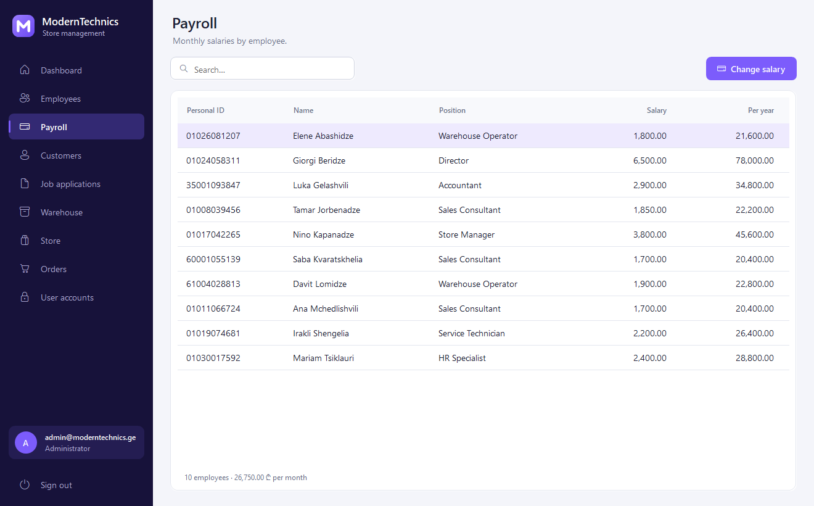
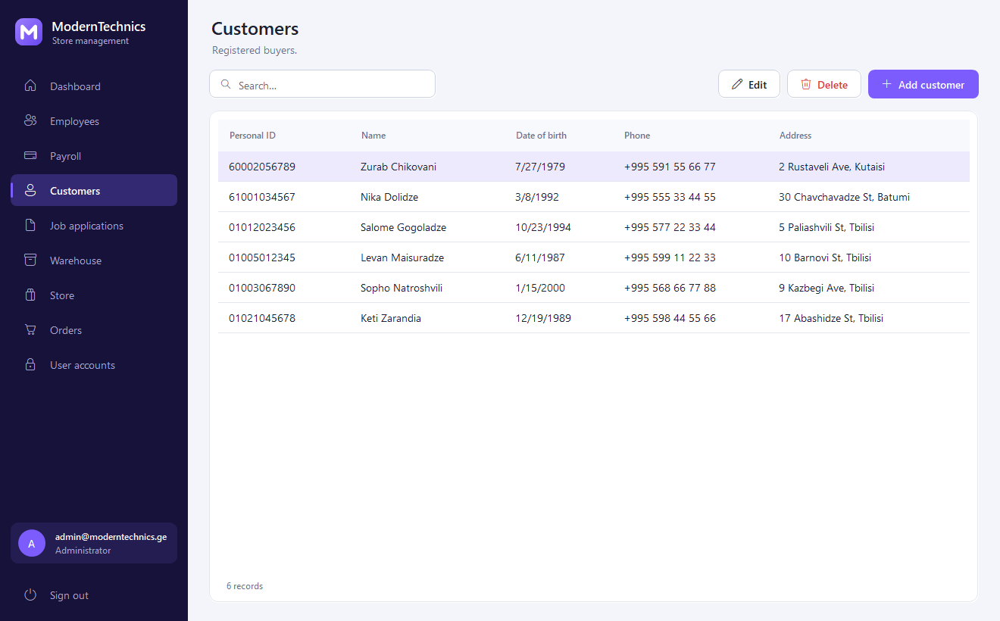
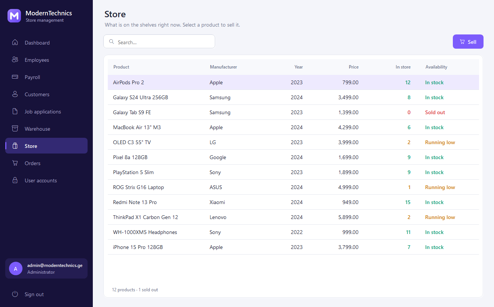
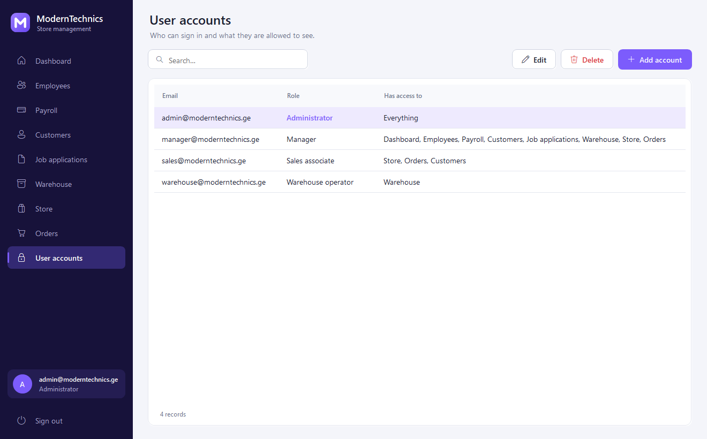
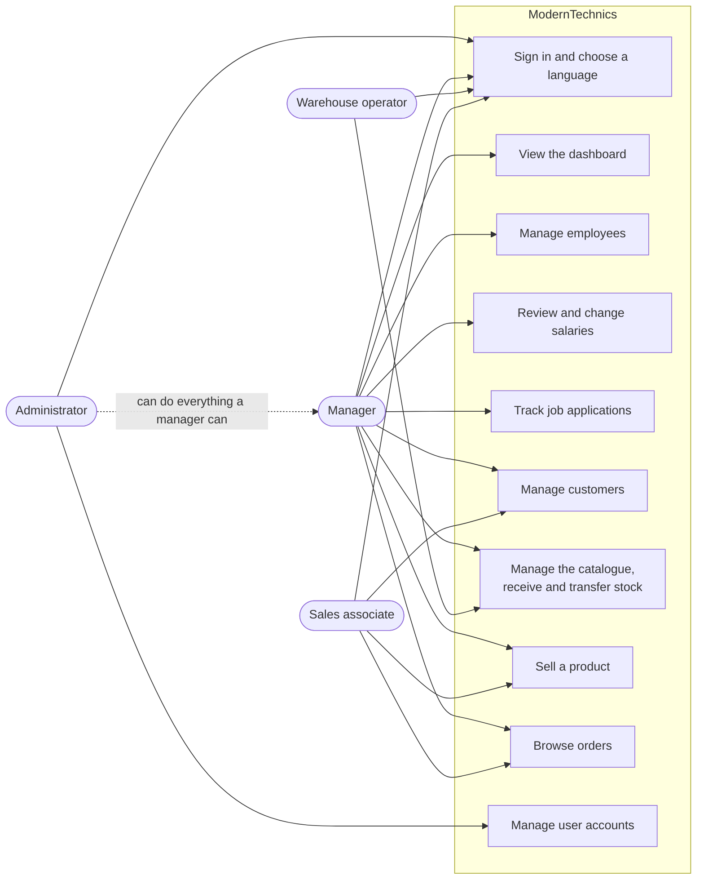
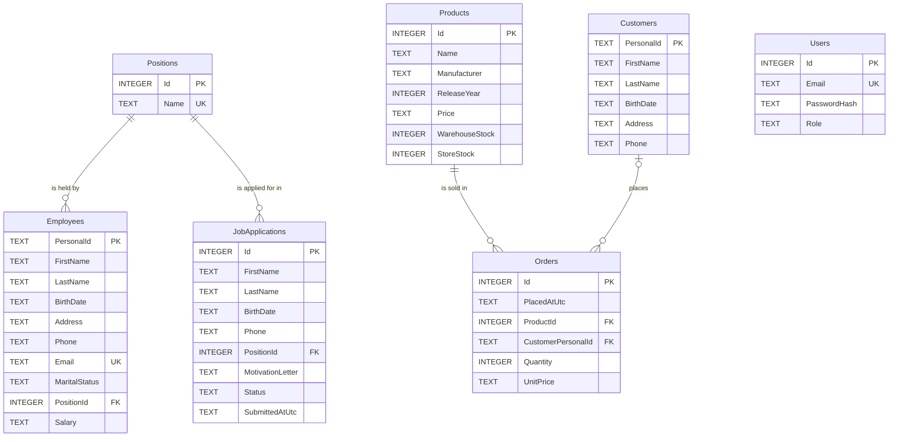

<h1 align="center">ModernTechnics</h1>

<p align="center">
  A Windows desktop back-office for an electronics store: staff, payroll, hiring, warehouse stock, shop-floor sales and role-based access, in English and Georgian.
</p>

<p align="center">
  <a href="https://github.com/MrTabaOfficial/ModernTechnics-Management-System/actions/workflows/ci.yml"></a>
  
  
  
  
  
  
  
</p>

<p align="center"><b>English</b> · <a href="README.ka.md">ქართული</a></p>


## About

ModernTechnics is a desktop application for the staff of a single electronics shop. A manager keeps employee
records, salaries and job applications in it, a warehouse operator books deliveries and moves stock to the shop
floor, and a sales associate sells from the shelf and looks up past orders. Each person signs in with their own
account and sees only the screens their role allows.

I first wrote this as a third-year university coursework project on .NET Framework 4.7.2, with SQL Server Express
and a commercial UI kit. I later rebuilt it from an empty solution to practise the things the first version
lacked: a layered solution (Core, Infrastructure, App, Tests), EF Core with migrations, salted password hashing,
controls drawn in code with GDI+ instead of a UI library, a two-language interface, and tests that run against a
real SQLite database. The coursework code is still in the Git history.

> **This is a learning project with sample data.** The employees, customers, orders and job applications are
> invented and are seeded on first launch, together with four demo accounts that share a published password.
> Each Windows user gets their own local database file, so it is not a multi-user system. An order is one product
> and a quantity; there are no baskets, refunds or receipts.

## Contents

- [Features](#features)
- [Screenshots](#screenshots)
- [Use case diagram](#use-case-diagram)
- [Database](#database)
- [Tech stack](#tech-stack)
- [Project structure](#project-structure)
- [Setup](#setup)
- [Screens and entry points](#screens-and-entry-points)
- [Security](#security)
- [Credits](#credits)
- [License](#license)

## Features

**Sign-in and accounts**

- Sign in with an email and password; the window remembers the last email used.
- Switch between English and Georgian on the sign-in window; the choice is kept between launches.
- Fill in any of the four demo accounts with one click.
- See only the modules your role may open in the sidebar, and sign out back to the sign-in window.
- As an administrator: create accounts, change a role, set a new password and delete accounts. The last
  administrator cannot be demoted or deleted, and you cannot delete the account you are signed in with.

**Dashboard**

- See headcount, monthly payroll with the average salary, revenue for the last 30 days and units in stock.
- Read a bar chart of revenue for the last 7 days and a breakdown of the team by position.
- See which products have 5 or fewer units on the shelf, with a hint to move stock from the warehouse or reorder.

**Staff and payroll**

- Add, edit, search and delete employee records (11-digit personal number, position, contact details, marital
  status, salary). Employees must be at least 18.
- Review monthly and annual salary per employee with the monthly total, and change a salary.

**Hiring**

- Record a job application with the position applied for and a motivation letter.
- Open an application to read the letter, and move it between New, Interview, Hired and Rejected.
  Setting Hired only changes the status; it does not create an employee record.

**Warehouse**

- Add, edit and delete catalogue products. A product that has been sold cannot be deleted.
- Book a delivery into the warehouse and move units from the warehouse to the store. A transfer larger than the
  warehouse holds is refused.

**Store, orders and customers**

- See what is on the shelf with an In stock / Running low / Sold out label, and sell a quantity to a registered
  customer or a walk-in. The order stores the price at the time of sale.
- Browse and search all orders, with the order count, units and total at the bottom.
- Add, edit and delete customers. Deleting a customer keeps their orders, which then show as walk-in sales.

**Every list**

- Search as you type, sort by clicking a column header, and open the selected row with a double-click or Enter.
- Validation errors appear under the field they belong to, in the active language.

## Screenshots

| | |
| --- | --- |
| <br>Sign in, with demo accounts and the language switch | <br>Dashboard |
| <br>Employees | <br>Employee editor |
| <br>Payroll | <br>Customers |
| <br>Job applications | <br>Warehouse |
| <br>Store | <br>Sale dialog |
| <br>Orders | <br>User accounts (administrator only) |
| <br>The same app as a sales associate: three modules | <br>Dashboard in Georgian |

All of these are produced by the application itself; see [Setup](#setup).

## Use case diagram



## Database



Every employee and every job application points at one position, every order points at one product and
optionally at one customer (the link is set to null when the customer is deleted), and `Users` stands alone:
a sign-in account is not linked to an employee record. Money and dates are `TEXT` because that is how EF Core
stores `decimal`, `DateOnly` and `DateTime` in SQLite; `Products` also has check constraints that keep both
stock columns at zero or above.

## Tech stack

| Layer | Technology |
| --- | --- |
| Language | C# 14, nullable reference types on, warnings treated as errors |
| Runtime | .NET 10 (`net10.0`, and `net10.0-windows` for the client) |
| UI | Windows Forms, built in code without the designer |
| Drawing | GDI+ (`System.Drawing`) for buttons, cards, inputs, charts, toasts and the logo |
| Icons | Segoe Fluent Icons, falling back to Segoe MDL2 Assets on Windows 10 |
| Data access | Entity Framework Core 10.0.12 with one migration |
| Database | SQLite, through `Microsoft.EntityFrameworkCore.Sqlite` 10.0.12 |
| Composition | `Microsoft.Extensions.DependencyInjection` 10.0.12 |
| Password hashing | PBKDF2-HMAC-SHA256 from `System.Security.Cryptography` |
| Localisation | `.resx` string tables for English and Georgian, both in the main assembly |
| Tests | xUnit v3 3.2.2 and Microsoft.NET.Test.Sdk 18.10.1, against in-memory SQLite |
| CI | GitHub Actions on `windows-latest`: restore, build, test, publish |
| Tooling | Central Package Management, `.editorconfig`, SDK pinned in `global.json` |

## Project structure

```text
ModernTechnics-Management-System/
├── .github/workflows/ci.yml             # build, test and publish on push and pull request
├── docs/screenshots/                    # README images, generated by the app
├── src/
│   ├── ModernTechnics.Core/             # domain; no package references
│   │   ├── Common/
│   │   │   ├── Error.cs                 # error record and the list of error codes
│   │   │   └── Result.cs                # Result and Result<T> returned by every service
│   │   ├── Domain/                      # Employee, Customer, Product, Order, JobApplication,
│   │   │                                #   Position, UserAccount and the enums
│   │   ├── Security/
│   │   │   ├── AccessPolicy.cs          # which role may open which module
│   │   │   └── IPasswordHasher.cs
│   │   ├── Services/
│   │   │   ├── Contracts.cs             # service interfaces
│   │   │   └── DashboardSummary.cs      # figures shown on the dashboard
│   │   └── Validation/
│   │       ├── Validator.cs             # fluent rule collector (email, phone, personal ID, …)
│   │       └── EntityValidators.cs      # rules per entity
│   ├── ModernTechnics.Infrastructure/   # data access and service implementations
│   │   ├── Data/
│   │   │   ├── AppDbContext.cs          # mapping, indexes, constraints
│   │   │   ├── DatabaseInitializer.cs   # migrates, then seeds an empty database
│   │   │   ├── DemoData.cs              # sample accounts, staff, products, orders
│   │   │   ├── DesignTimeDbContextFactory.cs  # for the dotnet ef tooling
│   │   │   └── Migrations/              # generated by EF Core
│   │   ├── Security/Pbkdf2PasswordHasher.cs
│   │   ├── Services/                    # Auth, User, Employee, Customer, JobApplication,
│   │   │   │                            #   Inventory, Sales and Dashboard services
│   │   │   └── Search.cs                # escapes search text for LIKE
│   │   └── DependencyInjection.cs       # AddModernTechnics() registration
│   └── ModernTechnics.App/              # Windows Forms client
│       ├── Assets/app.ico
│       ├── Controls/                    # AppButton, AppGrid, Card, Charts, FieldHost,
│       │                                #   FormField, NavButton, StatCard, Toast
│       ├── Forms/
│       │   ├── LoginForm.cs             # sign-in, language switch, demo accounts
│       │   ├── MainForm.cs              # sidebar, header and the navigation guard
│       │   └── FormDialog.cs            # generic add/edit dialog with per-field errors
│       ├── Localization/
│       │   ├── L.cs                     # string lookup, money and date formatting
│       │   ├── Strings.resx             # English
│       │   └── Strings.ka.resx          # Georgian
│       ├── Pages/
│       │   ├── PageBase.cs              # build once, reload on every visit
│       │   ├── ListPage.cs              # search box, sortable grid and toolbar
│       │   └── *Page.cs                 # one page per module, nine in total
│       ├── Ui/                          # Theme (colours, fonts, DPI), Draw, Brand, Shell
│       ├── AppSettings.cs               # data folder and saved preferences
│       ├── Program.cs                   # entry point
│       └── ScreenshotRunner.cs          # --screenshots mode
├── tests/
│   └── ModernTechnics.Tests/
│       ├── Localization/ResourceTests.cs    # both string tables match each other and the code
│       ├── Security/                        # password hasher, access policy
│       ├── Services/                        # auth and users, people, stock and sales
│       ├── Support/                         # in-memory SQLite database, fixed clock
│       └── Validation/ValidatorTests.cs
├── .editorconfig                        # code style
├── Directory.Build.props                # compiler settings shared by all projects
├── Directory.Packages.props             # NuGet versions in one place
├── global.json                          # pinned .NET SDK
├── ModernTechnics.slnx                  # solution
├── README.md
├── README.ka.md
└── LICENSE
```

## Setup

**Requirements**

- Windows 10 or 11. The client is Windows Forms, so it does not run on Linux or macOS.
- [.NET 10 SDK](https://dotnet.microsoft.com/download/dotnet/10.0), version 10.0.100 or a later 10.0 release.
- Git.

There is no database server to install and no configuration or environment file to fill in.

**Steps**

1. Clone the repository.

   ```powershell
   git clone https://github.com/MrTabaOfficial/ModernTechnics-Management-System.git
   cd ModernTechnics-Management-System
   ```

2. Build the solution. This also restores the NuGet packages.

   ```powershell
   dotnet build
   ```

3. Start the application.

   ```powershell
   dotnet run --project src/ModernTechnics.App
   ```

4. The database needs no manual step. On first launch the app creates
   `%LOCALAPPDATA%\ModernTechnics\moderntechnics.db`, applies the EF Core migration and, because the `Users`
   table is empty, fills the database with the demo data.

5. Sign in with one of the demo accounts. They all use the password `Demo1234`, and the buttons at the bottom
   of the sign-in window fill them in for you.

   | Role | Email |
   | --- | --- |
   | Administrator | `admin@moderntechnics.ge` |
   | Manager | `manager@moderntechnics.ge` |
   | Warehouse operator | `warehouse@moderntechnics.ge` |
   | Sales associate | `sales@moderntechnics.ge` |

6. Run the tests.

   ```powershell
   dotnet test
   ```

   The suite has 93 tests. They run the real services against an in-memory SQLite database, so they cover the
   SQL that EF Core generates, the constraints and the transaction around a sale.

**Starting again from the demo data**

Close the app and delete the data folder; the next launch recreates it.

```powershell
Remove-Item -Recurse "$env:LOCALAPPDATA\ModernTechnics"
```

**Regenerating the screenshots**

The app can open every screen against a temporary database and save a PNG of each:

```powershell
dotnet run --project src/ModernTechnics.App -- --screenshots docs/screenshots
dotnet run --project src/ModernTechnics.App -- --screenshots docs/screenshots --lang ka
```

> If Windows Smart App Control is switched on, it can refuse to load a freshly compiled, unsigned build of any
> application, this one included. Windows reports that as "An Application Control policy has blocked this file".

## Screens and entry points

This is a desktop application, so it has no HTTP routes. The table lists what it has instead: the ways to start
it and the screens (modules) inside it. Access comes from
[AccessPolicy.cs](src/ModernTechnics.Core/Security/AccessPolicy.cs).

| Entry point | Who can open it | Purpose |
| --- | --- | --- |
| `ModernTechnics.exe` | Anyone who can start the app | Sign-in window with the language switch |
| Dashboard | Administrator, Manager | Key figures, 7-day revenue chart, team by position, low stock |
| Employees | Administrator, Manager | Add, edit, search and delete staff records |
| Payroll | Administrator, Manager | Monthly and annual salaries, change a salary |
| Customers | Administrator, Manager, Sales associate | Register of buyers |
| Job applications | Administrator, Manager | Record candidates and change their status |
| Warehouse | Administrator, Manager, Warehouse operator | Catalogue, deliveries, transfers to the store |
| Store | Administrator, Manager, Sales associate | Shelf stock and selling |
| Orders | Administrator, Manager, Sales associate | Read-only list of completed sales |
| User accounts | Administrator | Accounts, roles and passwords |
| `ModernTechnics.exe --screenshots <dir> [--lang en\|ka]` | Developer, from the command line | Saves a PNG of every screen using a temporary database |

After signing in, each role lands on the first module in its list: the dashboard for administrators and
managers, the warehouse for warehouse operators and the store for sales associates.

## Security

What the code does today:

- Passwords are stored as PBKDF2-HMAC-SHA256 hashes with 210,000 iterations and a random 16-byte salt per
  password. The iteration count is saved with each hash, and comparison is constant-time.
- Sign-in returns the same error for an unknown email and a wrong password.
- New passwords must be at least 8 characters and contain a letter and a digit.
- One class, `AccessPolicy`, decides which role may open which module. The sidebar is built from it and
  `MainForm.NavigateAsync` checks it again before showing a page.
- The last administrator cannot be demoted or deleted, and an account cannot delete itself.
- All database access goes through EF Core with parameterised queries, and search text is escaped before it is
  used in a `LIKE` pattern, so `%`, `_` and quotes are treated as plain text.
- Input is validated in the services, not only in the forms, and the schema adds unique indexes on emails,
  restricting foreign keys and check constraints that stop stock going below zero.
- A sale runs in a transaction and takes stock with a single conditional `UPDATE … WHERE StoreStock >= quantity`,
  so an order is never recorded for units that are not there.
- Screenshot mode works on a temporary database and never opens the user's data.

What I would change before using it for a real shop:

- Remove the demo seeding, the demo buttons and the demo password shown on the sign-in window, and create the
  first administrator during setup instead.
- Add a limit on failed sign-in attempts. There is none now, and there is no idle sign-out.
- Check roles inside the services as well. At the moment the role check lives in the client; that is enough for
  one process on one PC, but not if the services were ever put behind an API.
- Protect the data file. The SQLite database is an unencrypted file in the Windows user's profile, so anyone who
  can read that file can read the personal data and edit roles in it.
- Move to a shared database server if more than one PC should see the same stock, and add an audit log of who
  changed what.
- Sign the build so Windows does not block or warn about it.

## Credits

| What | Used for | License |
| --- | --- | --- |
| [Entity Framework Core](https://github.com/dotnet/efcore) and `Microsoft.Data.Sqlite` 10.0.12 | Data access | MIT |
| [SQLitePCLRaw](https://github.com/ericsink/SQLitePCL.raw) 2.1.12 (pulled in by EF Core) | Native SQLite bundle | Apache-2.0 |
| [SQLite](https://www.sqlite.org/copyright.html) | Database engine | Public domain |
| [Microsoft.Extensions.DependencyInjection](https://github.com/dotnet/runtime) 10.0.12 | Service container | MIT |
| [xUnit.net v3](https://github.com/xunit/xunit) 3.2.2 and `xunit.runner.visualstudio` 3.1.5 | Tests | Apache-2.0 |
| [Microsoft.NET.Test.Sdk](https://github.com/microsoft/vstest) 18.10.1 | Test host | MIT |
| Segoe UI, Segoe Fluent Icons, Segoe MDL2 Assets | Text and icons | Fonts installed with Windows; used at run time, not included in this repository |

No UI template, icon pack or stock image is used. The controls, charts and the logo are drawn in code. The
people in the demo data are invented; the product names are real products, used only as sample catalogue
entries, and belong to their manufacturers.

## License

[MIT](LICENSE)
